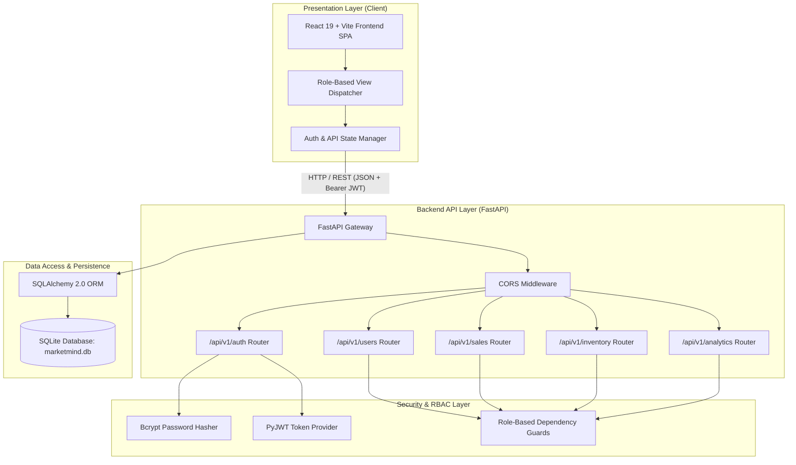
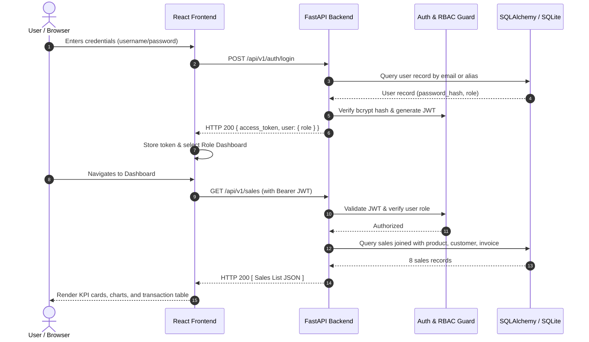

# MarketMind AI — System Architecture

## 1. Architectural Overview

MarketMind AI is designed as a modular, tiered web application optimized for reliability, clear separation of concerns, and security. The architecture separates the user presentation tier, backend API and business logic tier, authentication/authorization tier, and persistent storage tier.

---

## 2. Component Responsibilities

### Presentation Layer (`frontend/`)
- **Technology**: React 19, Vite, Vanilla CSS.
- **Responsibility**: Provides responsive, accessible, and role-tailored dashboards for Business Owner, Store Manager, Sales Executive, and System Administrator.
- **Session Management**: Securely preserves the signed JWT token in browser `localStorage` and injects `Authorization: Bearer <token>` into outbound HTTP requests via `src/api.js`.

### Backend API Layer (`backend/`)
- **Technology**: FastAPI, Pydantic V2, Uvicorn.
- **Responsibility**: Handles request validation, routes incoming HTTP calls, performs business aggregations (sales summaries, reorder alerts, daily trend lines), and serves interactive OpenAPI documentation at `/docs`.

### Authentication & RBAC Layer (`backend/auth.py`, `backend/dependencies.py`)
- **Technology**: `bcrypt` for one-way password hashing, `PyJWT` for compact, stateless JSON Web Tokens.
- **Responsibility**: Verifies credentials, signs tokens with expiration timestamps, parses bearer headers, and executes role checks. Unauthenticated requests are rejected with `401 Unauthorized`, and unauthorized access to privileged endpoints (e.g. non-admin accessing `/api/v1/users`) is rejected with `403 Forbidden`.

### Data Persistence Layer (`backend/database.py`, `backend/models.py`)
- **Technology**: SQLAlchemy 2.0 ORM, SQLite 3.
- **Responsibility**: Enforces relational schema integrity with primary keys, foreign keys, unique constraints, and indexes across 6 tables: `users`, `customers`, `products`, `sales`, `inventory`, and `invoices`.

---

## 3. End-to-End Data Flow

---

## 4. Security & Role Permissions Matrix

| Endpoint | HTTP Method | Allowed Roles | Description |
|---|---|---|---|
| `/` | GET | Public | API health check |
| `/api/v1/auth/login` | POST | Public | Authenticate user & issue JWT |
| `/api/v1/auth/register` | POST | Public / Admin | Register new account |
| `/api/v1/auth/me` | GET | All authenticated roles | Retrieve current user profile |
| `/api/v1/sales` | GET | `owner`, `manager`, `sales_executive`, `admin` | List all sales transactions |
| `/api/v1/sales/summary` | GET | `owner`, `manager`, `sales_executive`, `admin` | Compute total revenue, orders, AOV |
| `/api/v1/inventory` | GET | `owner`, `manager`, `admin`, `sales_executive` | List inventory stock levels |
| `/api/v1/inventory/alerts` | GET | `owner`, `manager`, `admin`, `sales_executive` | Filter items below reorder threshold |
| `/api/v1/analytics/summary`| GET | `owner`, `manager`, `admin`, `sales_executive` | High-level KPIs, charts, trends |
| `/api/v1/users` | GET | **`admin` only** | List all users (403 for other roles) |
