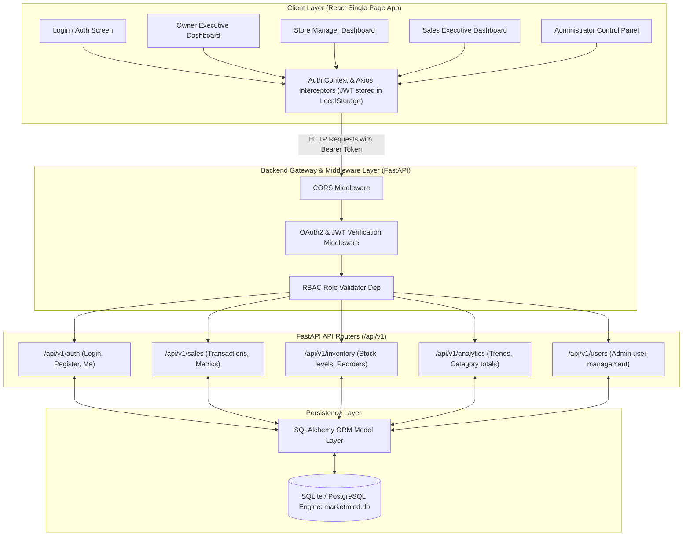
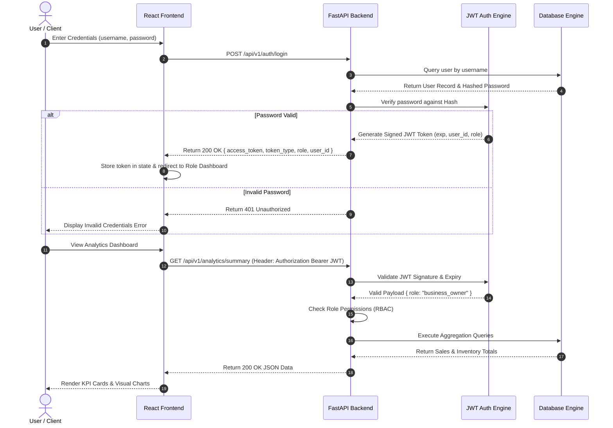

# MarketMind AI — Architecture Specification

## 1. System Overview

MarketMind AI is designed as a modern, high-performance web application utilizing a decoupled RESTful architecture. The system comprises a responsive React single-page application (SPA) on the frontend, a high-throughput Python FastAPI application on the backend, and a relational database (SQLite for development / PostgreSQL ready) for state and transactional storage.

---

## 2. System Architecture Diagram

---

## 3. Technology Stack

| Layer | Technology Selected | Rationale |
| :--- | :--- | :--- |
| **Frontend UI** | React 18 (Vite) + Lucide Icons + Recharts | Fast rendering, modular component structure, and responsive rich interactive data visualization. |
| **Frontend Styling** | Modern Vanilla CSS / Glassmorphism Design | High aesthetic control, CSS custom properties design tokens, and smooth micro-animations. |
| **Backend API** | FastAPI (Python 3.14) | Asynchronous non-blocking framework, auto-generated OpenAPI / Swagger docs, fast execution speed. |
| **Security Layer** | Passlib (Bcrypt) + PyJWT | Industry standard password hashing and stateless token-based authorization. |
| **Database** | SQLite / SQLAlchemy ORM | Lightweight relational persistence zero-config setup, easily swappable with PostgreSQL via connection URI. |
| **Data Cleaning** | Pandas & Python standard library | Efficient data normalization, string cleansing, date parsing, and missing value imputation. |

---

## 4. Security & Access Control Flow

