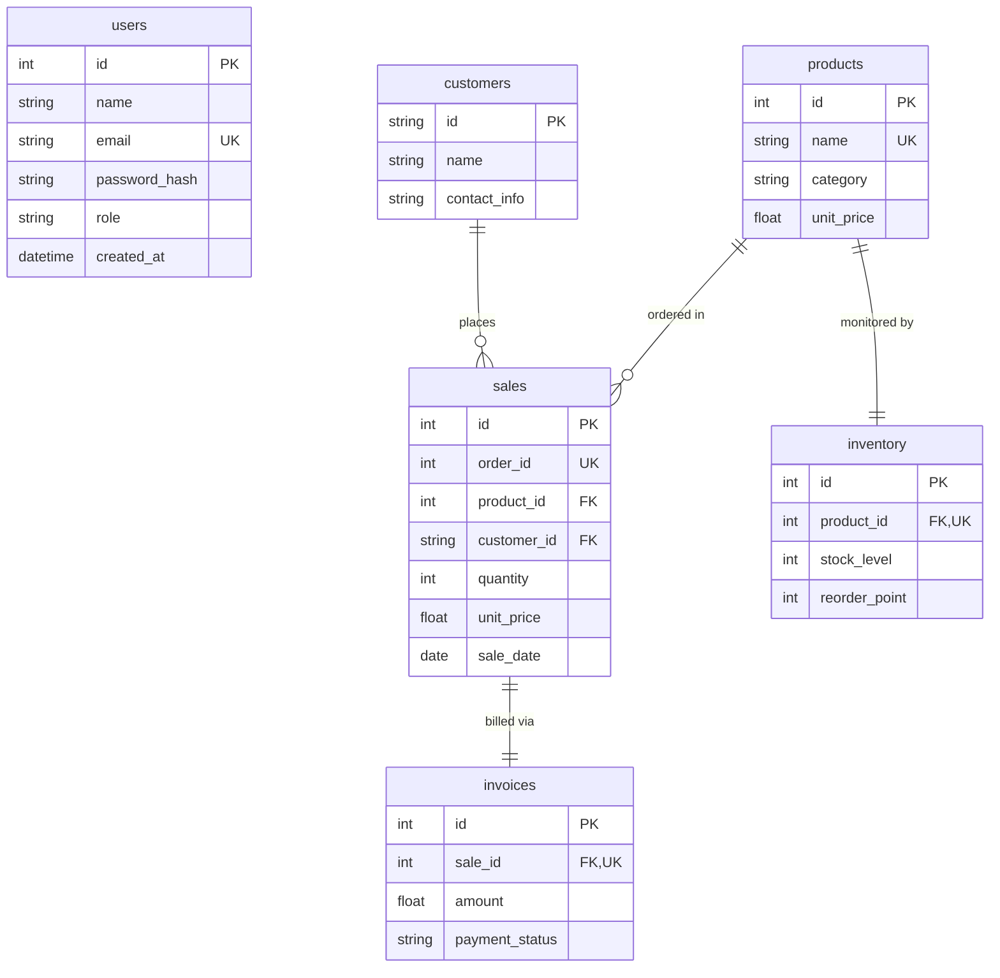

# MarketMind AI — Database Schema & ERD

## 1. Entity-Relationship Diagram (ERD)

---

## 2. Table Specifications & Relationships

### 1. `users` Table
- **Purpose**: Manages system authentication credentials, display identities, and role assignments.
- **Primary Key**: `id` (INTEGER, Autoincrement)
- **Unique Constraints**: `email` (VARCHAR 120)
- **Indexes**: `ix_users_id`, `ix_users_email`

### 2. `customers` Table
- **Purpose**: Master entity for commercial client profiles.
- **Primary Key**: `id` (VARCHAR 50, e.g., `C001`)
- **Indexes**: `ix_customers_id`
- **Relationships**: One-to-Many with `sales`.

### 3. `products` Table
- **Purpose**: Master catalog of items available for sale.
- **Primary Key**: `id` (INTEGER, Autoincrement)
- **Unique Constraints**: `name` (VARCHAR 120)
- **Indexes**: `ix_products_id`
- **Relationships**: One-to-Many with `sales`, One-to-One with `inventory`.

### 4. `sales` Table
- **Purpose**: Records individual transaction orders.
- **Primary Key**: `id` (INTEGER, Autoincrement)
- **Unique Constraints**: `order_id` (INTEGER)
- **Foreign Keys**:
  - `product_id` REFERENCES `products(id)`
  - `customer_id` REFERENCES `customers(id)`
- **Indexes**: `ix_sales_id`, `ix_sales_order_id`
- **Relationships**: Belongs to `Product`, Belongs to `Customer`, One-to-One with `Invoice`.

### 5. `inventory` Table
- **Purpose**: Real-time stock counts and replenishment threshold configuration.
- **Primary Key**: `id` (INTEGER, Autoincrement)
- **Unique Constraints**: `product_id` (INTEGER)
- **Foreign Keys**: `product_id` REFERENCES `products(id)`
- **Indexes**: `ix_inventory_id`
- **Relationships**: One-to-One with `Product`.

### 6. `invoices` Table
- **Purpose**: Financial settlement tracking and payment confirmation.
- **Primary Key**: `id` (INTEGER, Autoincrement)
- **Unique Constraints**: `sale_id` (INTEGER)
- **Foreign Keys**: `sale_id` REFERENCES `sales(id)`
- **Indexes**: `ix_invoices_id`
- **Relationships**: One-to-One with `Sale`.
