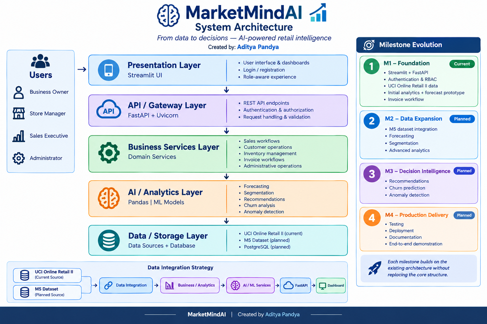

# MarketMindAI — Milestone 1 Evidence

**Project:** MarketMindAI — Business Sales Intelligence Platform  
**Author:** Aditya Pandya  
**Program:** Infosys-Springboard Internship  
**Milestone:** Milestone 1 — Foundation  
**Branch:** `aditya-pandya-milestone-1`

---

## 1. Milestone Overview

Milestone 1 establishes the initial foundation of the MarketMindAI platform.

The milestone focuses on:

- Retail dataset organization
- Initial system and UI planning
- Streamlit frontend skeleton
- FastAPI backend skeleton
- Authentication
- Role-Based Access Control (RBAC)
- Initial sales intelligence
- Forecast prototype
- Invoice workflow
- Administrative user access

The implementation is intentionally kept aligned with the approved project architecture and is designed to support later milestone extensions.

---

## 2. Milestone 1 Architecture

The current M1 implementation follows this flow:

```text
User
  │
  ▼
Streamlit Frontend
  │
  ▼
FastAPI Backend
  │
  ├── Authentication / RBAC
  ├── Sales Summary
  ├── Forecast Prototype
  ├── Invoice Workflow
  └── Admin User View
  │
  ▼
UCI Online Retail II CSV Sources
  │
  ▼
Pandas Processing + In-Memory Analytics
```

The current implementation is intentionally simpler than the long-term target architecture. PostgreSQL integration and expanded analytics are planned for later milestones.

---

## 3. Data Foundation

### Current Dataset

Milestone 1 uses the UCI Online Retail II transaction dataset.

The source data contains fields including:

- Invoice number
- Stock/Product code
- Product description
- Quantity
- Invoice date
- Unit price
- Customer identifier
- Country

The original retail data is retained as the foundation for the current analytics workflow.

### Inventory Representation

Milestone 1 does not contain verified physical warehouse stock records.

The current inventory values are therefore estimates derived from sales data.

The documented calculation is:

```text
Initial Stock = Total Units Sold × 1.5

Estimated Remaining Stock =
Initial Stock − Total Units Sold
```

These values are estimates and are not presented as observed physical inventory.

---

# 4. Milestone 1 Evidence

## M1-E01 — Login

### Objective

Provide user authentication through the FastAPI backend and Streamlit interface.

### Implemented

- Login interface
- JWT-based authentication
- Bearer-token authentication
- Password hashing

### Evidence

[Login](screenshots/01-Login.png)

**Status:** ✅ Implemented

---

## M1-E02 — User Registration

### Objective

Provide a registration workflow for creating a user account.

### Implemented

- Registration interface
- Registration API endpoint
- Password handling

### Evidence

[Create Login / Registration](screenshots/08-Create-Login.png)

**Status:** ✅ Implemented

---

## M1-E03 — Business Dashboard

### Objective

Provide a central dashboard for viewing the current business information.

### Implemented

- Dashboard interface
- Sales overview
- Business KPI presentation
- Connection to backend services

### Evidence

[Dashboard](screenshots/02-Dashboard.png)

**Status:** ✅ Implemented

---

## M1-E04 — Sales Analytics

### Objective

Provide initial sales intelligence from the UCI Online Retail II dataset.

### Implemented

The backend prepares analytical information including:

- Total revenue
- Total valid orders
- Top product by quantity

### Evidence

[Sales Analytics](screenshots/03-Sales-Analytics.png)

**Status:** ✅ Implemented

---

## M1-E05 — Forecast Prototype

### Objective

Provide an initial forecasting workflow that establishes the foundation for later forecasting development.

### Implemented

- Forecast API route
- Forecast presentation in the dashboard
- Initial forecast/trend output

### Important Note

This is a prototype/initial forecasting implementation and is not yet presented as a validated production forecasting model.

### Evidence

[Forecast](screenshots/04-Forecast.png)

**Status:** 🟡 Prototype / Further validation required

---

## M1-E06 — Invoice Workflow

### Objective

Provide an initial invoice-related workflow within the application.

### Implemented

- Invoice view workflow
- Invoice creation workflow
- Backend invoice endpoints

### Evidence

[Invoice](screenshots/05-Invoice.png)

**Status:** 🟡 Prototype / Further persistence and validation required

---

## M1-E07 — Role-Based Access Control

### Objective

Restrict application functionality according to user role.

### Roles

The current application models:

- `business_owner`
- `store_manager`
- `sales_executive`
- `admin`

### Implemented

- Role-aware authentication
- Protected endpoints
- Role validation
- Administrative user view

### Evidence

[RBAC / Admin](screenshots/06-RBAC-Admin.png)

**Status:** ✅ Implemented

---

## M1-E08 — Milestone 1 Application Preview

### Objective

Demonstrate the integrated Milestone 1 application flow.

### Evidence

[Milestone 1 Preview](screenshots/07-MilestonePreview.png)

**Status:** ✅ M1 Foundation Demonstration

---

# 5. Milestone 1 Status Matrix

| Area | Status | Notes |
|---|---|---|
| Dataset organization | ✅ Implemented | UCI Online Retail II |
| System architecture | ✅ Implemented | Documented layered architecture |
| Streamlit frontend | ✅ Implemented | Current M1 presentation layer |
| FastAPI backend | ✅ Implemented | Current API layer |
| Authentication | ✅ Implemented | JWT + password hashing |
| RBAC | ✅ Implemented | Role-aware protected endpoints |
| Sales analytics | ✅ Implemented | Initial KPI calculations |
| Forecasting | 🟡 Prototype | Requires further validation |
| Invoice workflow | 🟡 Prototype | Requires persistence/hardening |
| Inventory | 🟡 Estimated | Derived from sales, not physical stock |
| PostgreSQL | 🔵 Planned | Application integration is a future step |
| Walmart M5 | 🔵 Planned | Milestone 2 data expansion |

---

# 6. Current Limitations

The following limitations are intentionally documented:

- User information is currently maintained in application memory.
- Current analytics use CSV-based source data.
- PostgreSQL application integration is not yet complete.
- Forecasting is still a prototype and requires validation.
- Invoice workflows require persistence and additional validation.
- Inventory values are estimates rather than physical stock observations.
- Production-level secret and configuration hardening remains pending.
- Broader automated testing and deployment are planned for later milestones.

---

# 7. Security Foundation

The M1 authentication flow is:

```text
User
  │
  ├── Register
  │
  └── Login
        │
        ▼
     JWT Token
        │
        ▼
 Authorization Header
        │
        ▼
 FastAPI Authentication
        │
        ▼
 Role Validation
        │
        ▼
 Protected Endpoint
```

Further production hardening will include stronger secret management, persistent user storage, production CORS configuration, and expanded security testing.

---

# 8. M1 API Evidence

| Method | Endpoint | Purpose |
|---|---|---|
| `POST` | `/register` | Register a user |
| `POST` | `/login` | Authenticate a user |
| `GET` | `/sales/summary` | Return sales KPI summary |
| `GET` | `/forecast/revenue` | Return forecast prototype output |
| `GET` | `/invoices/view` | View invoice workflow |
| `POST` | `/invoices/create` | Create invoice workflow entry |
| `GET` | `/admin/users` | Authorized administrative user view |

---

# 9. Documentation and Repository Evidence

The Milestone 1 implementation is supported by:

- Source code
- Architecture documentation
- Application screenshots
- Dataset documentation
- API endpoints
- Authentication implementation
- RBAC implementation
- Validation notes
- Milestone evidence record

### Architecture Documentation

[System Architecture](architecture/architecture.md)

### Visual Architecture



---

# 10. Milestone 2 Continuation

Milestone 1 establishes the foundation for subsequent development.

The planned Milestone 2 direction includes:

- Walmart M5 data integration
- Expanded forecasting
- Customer segmentation
- Additional analytics
- Business intelligence improvements

The M5 dataset will remain a distinct source with its own identifiers and provenance rather than assuming that its identifiers directly correspond to UCI identifiers.

---

# 11. Final Milestone 1 Assessment

Milestone 1 establishes the initial MarketMindAI foundation across:

```text
Data
  ↓
Architecture
  ↓
FastAPI Backend
  ↓
Streamlit Frontend
  ↓
Authentication
  ↓
RBAC
  ↓
Sales Intelligence
  ↓
Prototype Analytics
```

The repository is structured so that future milestones extend the existing foundation rather than replacing the approved application architecture.

---

## Author

**Aditya Pandya**

Infosys-Springboard Internship Project

**MarketMindAI — Business Sales Intelligence Platform**