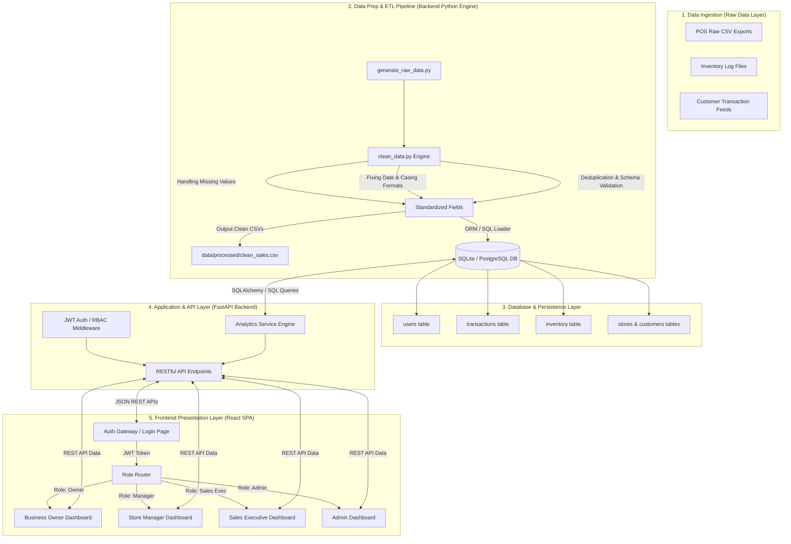

# MarketMind AI — Project Objectives & Overview

## 1. Problem Statement

Small and medium retail businesses face critical operational bottlenecks:
- **Fragmented Sales Data**: Sales transactions are recorded across disparate Point-of-Sale (POS) systems, cash logs, and manual spreadsheets without centralized analytics.
- **Inventory Stockouts and Overstocking**: Lack of real-time inventory visibility leads to loss of sales due to stockouts of popular items or capital tied up in slow-moving merchandise.
- **Lack of Actionable Insights**: Business owners often lack data science tools to analyze customer purchase behavior, peak sales trends, or store performance across multiple locations.
- **Role Inaccessibility**: Front-line store managers and sales executives lack tailored, role-specific views suited to their daily workflow responsibilities.

**MarketMind AI** solves these challenges by providing an intelligent, lightweight sales and inventory intelligence platform. It ingests raw transactional data, cleans and structures it into relational storage, and provides role-aware dashboard analytics for real-time decision making.

---

## 2. Target User Personas & Roles

MarketMind AI features a **Role-Based Access Control (RBAC)** architecture supporting four distinct organizational roles:

| User Role | Key Responsibilities | Access Scope & Dashboard Views |
| :--- | :--- | :--- |
| **Business Owner** | Executive oversight, strategic planning, financial health tracking, location expansion. | **Global View**: Access to overall revenue, net sales trends, top performing products, cross-store metrics, and store comparison analytics. |
| **Store Manager** | Local inventory management, stock replenishment alerts, daily store sales targets. | **Store-Specific View**: Store inventory stock levels, low-stock reorder alerts, daily store sales performance, and staff/register metrics. |
| **Sales Executive** | Front-line customer interactions, individual transaction processing, daily targets. | **Personal / Operational View**: Personal sales total, recent transaction logs, product quick-lookup, and payment method statistics. |
| **Administrator** | System maintenance, user provision/deprovision, RBAC role assignment, system health audit. | **Admin Control Panel**: User management interface, database stats, role configuration, data pipeline status, and system audit logs. |

---

## 3. End-to-End Data Flow Architecture

The data pipeline transforms raw POS streams into actionable interactive dashboards:

---

## 4. Key Success Criteria (Milestone 1)

1. Automated synthetic data generation and cleaning script pipeline.
2. Normalized database schema supporting SQLite / relational persistence.
3. Modular FastAPI backend returning real-time sales and inventory metrics.
4. Interactive React single-page frontend with responsive charts and metrics cards.
5. RBAC security layer ensuring data isolation by user privilege level.
