# MarketMind AI — Project Objectives & Overview

## 1. Problem Statement
Small and medium-sized businesses (SMBs) often struggle to extract actionable insights from their day-to-day sales and inventory data. Critical operational information is commonly fragmented across disparate point-of-sale systems, spreadsheets, and paper records. As a consequence, business owners and store managers face:
- **Inventory Stockouts & Overstocking**: Inability to anticipate replenishment needs, causing lost revenue or bloated carrying costs.
- **Limited Strategic Visibility**: Lack of consolidated KPIs such as average order value (AOV), revenue trends, and top-performing products.
- **Inadequate Role Segregation**: Staff members lack customized interfaces suited to their specific operational responsibilities.

MarketMind AI is designed to solve these challenges through a centralized, role-based sales intelligence platform.

---

## 2. Target Users & Operational Roles

| Role | Target Persona | Primary Responsibilities | Milestone 1 Capabilities |
|---|---|---|---|
| **Business Owner** | Small business founder / owner | Strategic planning, high-level business performance, revenue growth | Full KPI dashboards, sales trend visualization, top products analysis, inventory status overview |
| **Store Manager** | Operational store manager | Inventory control, daily transactions, stock replenishment | Inventory table, reorder point monitoring, low-stock alerts, daily sales metrics |
| **Sales Executive** | Sales representative / counter staff | Customer engagement, order entry, invoicing | Sales transaction records, customer details, invoice tracking, personal performance view |
| **System Administrator** | IT admin / platform operator | User provisioning, system configuration, access governance | Full user management, role assignments, system status, unconstrained platform access |

---

## 3. Project Objectives (Milestone Breakdown)

### Milestone 1: Core Foundation & RBAC Platform (Current Scope)
- **Data Pipeline**: Clean and validate raw sales records with robust handling of missing values, negative counts, zero prices, duplicate rows, and date normalization.
- **Normalized Relational Schema**: Design and deploy a 3NF relational SQLite schema using SQLAlchemy ORM spanning Users, Customers, Products, Sales, Inventory, and Invoices.
- **Idempotent Data Seeding**: Guarantee deterministic, duplicate-free database population (`clean_sales_data.csv` -> exactly 8 cleaned sales records).
- **Secure Backend API**: FastAPI REST service with JWT authentication, bcrypt password hashing, and strict role-based access control (RBAC).
- **Responsive React Dashboard**: Role-tailored dashboards built with React and modern Vanilla CSS styling with interactive KPI cards, sales trend charts, and real-time inventory alerts.
- **Comprehensive Documentation**: Complete system architecture, data dictionary, database schema with ERD, and UI wireframes.

### Milestone 2: AI & Predictive Machine Learning (Future Scope)
- Time-series sales forecasting (Prophet, XGBoost, Random Forest).
- Customer segmentation (K-Means Clustering, RFM analysis).
- Customer churn prediction.
- Automated inventory reorder optimization.

### Milestone 3: Advanced Intelligence & Explainability (Future Scope)
- Collaborative filtering & product recommendation engine.
- Anomaly and fraud detection (Isolation Forest).
- Natural language query interface for business insights.

---

## 4. Data Sources

The platform ingests three primary data domains:
1. **Sales Transactions Data**: Order identifiers, product names, quantities sold, unit prices, order dates, and customer identifiers.
2. **Inventory Stock Data**: Product catalog, current stock on hand, and reorder threshold levels.
3. **Customer Master Data**: Customer identification codes, registered business names, and contact channels.

---

## 5. End-to-End Data Workflow

```mermaid
flowchart LR
    A[Raw Sales CSV] --> B[Data Exploration & Profiling]
    B --> C[Data Cleaning & Validation]
    C --> D[(Processed Sales CSV)]
    D --> E[Idempotent Database Loader]
    E --> F[(SQLite Relational DB)]
    F --> G[SQLAlchemy ORM Layer]
    G --> H[FastAPI REST Services]
    H --> I[JWT & RBAC Security Layer]
    I --> J[React + Vite Frontend Dashboard]
```

1. **Ingestion**: Raw transaction data is loaded from `data/raw/sales_data.csv`.
2. **Exploration**: `backend/data_exploration.py` profiles row counts, types, summary statistics, missing values, and duplicate rows.
3. **Cleaning**: `backend/data_cleaning.py` drops invalid quantities, zero prices, unparseable dates, and duplicates, yielding `data/processed/clean_sales_data.csv` (exactly 8 valid records).
4. **Storage**: `backend/load_data.py` idempotently seeds the SQLite database (`db/marketmind.db`) with normalized products, customers, sales, inventory, and invoices.
5. **API & Security**: FastAPI services expose verified endpoints protected by JWT bearer authentication and role checks.
6. **Presentation**: React frontend renders role-specific dashboards with live data from the backend.
